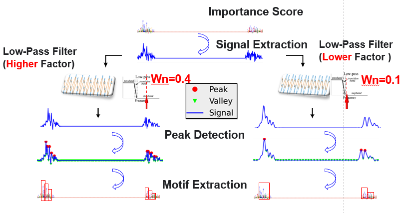

# RHSNet

## Introduction
This is the program implementation of the paper: [*Deep learning identifies and quantifies the recombination hotspot determinants*](). (currently under review)

State-of-the-art results are achieved on challenging benchmark datasets across different populations, sexes , and speceis. You can reproduce our results using this repo.


## Overall Framework of RHSNet
<div align="center">
    
</div>

## Environment
The code is developed using python 3.6 on Ubuntu 16.04. CUDA version is set to be 10.2. NVIDIA GPUs are needed. The code is developed and tested using 2 NVIDIA TITAN GPU cards. Other platforms or GPU cards are not fully tested.

Make sure to create the virtual environment by setting:

```
conda create -n rhsnet python=3.6
source activate rhsnet
```

Before running the experiments, pleas make sure that you have the following requirements:
`` tensorflow-gpu==1.12.0``,`` keras==2.2.4``,`` cudatoolkit==9.0``,and `` cudnn=7.1.2``. You can install the dependence by running:
```
conda install tensorflow-gpu==1.12.0 keras==2.2.4 cudatoolkit==9.0 cudnn=7.1.2 h5py
```

To install other required packages, please run the following:

```
pip install -r requirements.txt
```


## Dataset Construction

The pre-processed dataset for 5-fold cross validation and motif extraction is now publicaly available. You can directly download the dataset from [Google Drive](https://drive.google.com/drive/folders/1dUY9ZJGexdVGkmDkWhljhTXPPEBRN2wG?usp=sharing)

After downloading the dataset, please make sure to put all the folders in the the directory:`` dataset `` and make them looks like this: 


```
$ {RHSNet-master}
|-- dataset
  ├── AFR
  ├── AMR
  ├── EAS
  ├── EUR
  ├── SAS
  ├── human_science_2019
  ├── maternal_science_2019
  ├── paternal_science_2019
  ├── nature_2020
  ├── nature_genetics_2008
  ├── mouse_cell_2016
```
To be more specific:
The ``human_science_2019 `` repo refers to the Icelandic Human dataset published on Science 2019;
The ``nature_genetics_2008 `` repo refers to HapMap II datset;
The ``nature_2020`` repo refers to Sperm dataset published on Nature in Junee 2020;
The ``maternal_science_2019, paternal_science_2019`` repo refers to the generated hotspots and coldspots generated from paternal map and maternal map of the Icelandic Human dataset;
The ``mouse_cell_2016`` repo refers to the mouse dataset published on Cell 2016;


The raw data could be downloaded from [Google Drive](https://drive.google.com/drive/folders/1OhQXkUqQnyQp2IFE6buZRKr4yEMHvatf?usp=sharing)


## 5-fold cross validation experiments

For HapMap II or Sperm 2020 dataset, simply replace the directory name from ``human_science_2019 `` to ``nature_genetics_2008 `` or `` nature_2020`` 
For Mouse dataset, simply replace the directory name from ``human_science_2019 `` to ``mouse_cell_2016


### Train Baseline CNN on Icelandic Human Dataset
```
python 5_fold_cross_validation.py experiments/human_science_2019/1000_4/CNN/baseline_classification.json

```

### Train Equivalent CNN on Icelandic Human Dataset

```
python 5_fold_cross_validation.py experiments/human_science_2019/1000_4/CNN/mc_rc_classification.json

```

### Train RHSNet on Icelandic Human Dataset

```
python 5_fold_cross_validation.py experiments/human_science_2019/1000_4/RHSNet/attention_classification.json

```

### Train RHSNet-chip on Icelandic Human Dataset with sexual difference

```
python 5_fold_cross_validation.py experiments/maternal_science_2019/1000_4/RHSNet/reinforce_chip_seq.json
python 5_fold_cross_validation.py experiments/paternal_science_2019/1000_4/RHSNet/reinforce_chip_seq.json

```

### Train Baseline CNN on 1000 Genome dataset

```
python 5_fold_cross_validation.py experiments/26_population/AFR.json
python 5_fold_cross_validation.py experiments/26_population/AMR.json
python 5_fold_cross_validation.py experiments/26_population/EAS.json
python 5_fold_cross_validation.py experiments/26_population/EUR.json
python 5_fold_cross_validation.py experiments/26_population/SAS.json
```


## Trained Model weights

The trained model weights are also available in the folder ``model`` from [Google Drive](https://drive.google.com/drive/folders/1oafeCEKoWMXoaRpY20leyJnt7uJb0vv7?usp=sharing)


## Important Motif Extraction
<div align="center">
    
</div>
Our moitf extraction method is pretty much flexible, you can simple run (Take HapMap II Dataset as example):

```
python motif_extractor.py experiments/nature_genetics_2008/1000_4/CNN/baseline_classification.json

```

You can check ``motif_extractor_example.ipynb`` for a quick demo on the concept proof.

After running the above command, you should get a dir named ``/motifs`` and the following files:


```
└── nature_genetics_2008
    ├── filter0.1
    ├── filter0.1_motifs.json
    ├── filter0.2
    ├── filter0.2_motifs.json
    ├── filter0.4
    ├── filter0.4_motifs.json
    ├── recomb_rate.npy
    └── scores.npy

```


## Citation

If you use our code or models in your research, please cite with:
```
Our Paper in bibtex
```
